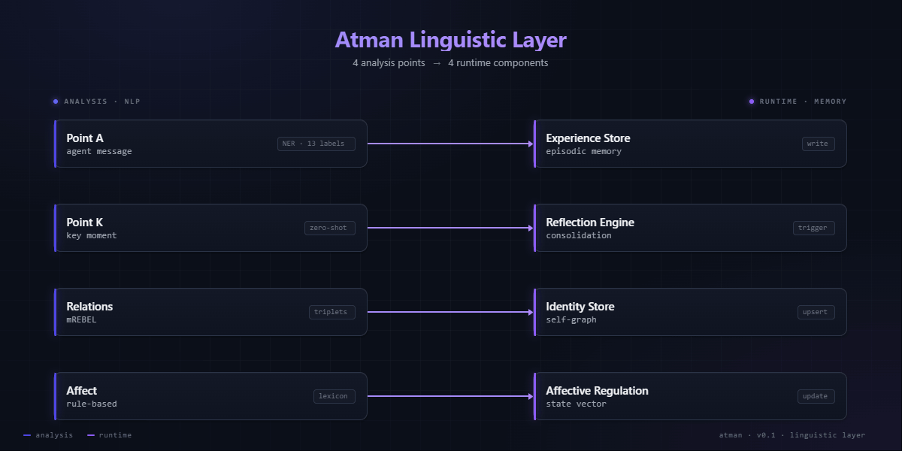

# Atman — Psychological Telemetry for AI Agents

*What your AI agent's **own text** reveals about its internal state.*

[Atman](https://github.com/hleserg/atman) is a psychological runtime layer for AI agents — first-person memory, continuous identity, reflection. It doesn't replace the LLM. It sits on top.

> **The lower agent acts. Atman exists.**

This Space is one sensor of the system — the linguistic + NLP block that scans every agent reply and every key moment, extracting signals that flow into the rest of the runtime.

## What this demo shows

| Tab | What it extracts | Where it goes in the runtime |
|---|---|---|
| **Point A** | 13-label NER + 5 zero-shot dimensions on every agent reply (stance, cognitive mode, self-orientation, primary emotion, cognitive load) | → Experience Store |
| **Point K** | 4 narrative markers + 7 zero-shot dimensions on key moments (agency, confidence, trust, boundary, connection, learning, growth) | → Reflection Engine (micro / daily / deep) |
| **Relations** | Entity-relation triplets via mREBEL | → Identity Store |
| **Affect** | EmoLex NRC emotions, behavioural metrics (hedge / self-ref / disclaimer / sincerity), 3-layer refusal detector | → Affective Regulation |

Everything is **bilingual** — RU and EN — at every layer. All ML models are multilingual; the rule-based layer uses parallel RU/EN dictionaries with morphology (pymorphy3) for Russian.

## Models used

- [`urchade/gliner_multi-v2.1`](https://huggingface.co/urchade/gliner_multi-v2.1) — multilingual NER
- [`MoritzLaurer/multilingual-MiniLMv2-L6-mnli-xnli`](https://huggingface.co/MoritzLaurer/multilingual-MiniLMv2-L6-mnli-xnli) — zero-shot classification
- [`Babelscape/mrebel-large`](https://huggingface.co/Babelscape/mrebel-large) — multilingual relation extraction
- NRC Emotion Lexicon (Saif Mohammad), RU + EN

## Try it

Each tab has dropdowns with bilingual presets — value refusals, capability refusals, hidden suppression in thinking, biographic graphs, sincere disclosure, and more. **First model load takes 30–60 s.** mREBEL is ~1.5 GB and ~10–20 s per inference on CPU-basic.

## The bigger picture

This Space shows the **sensor**. The full runtime adds:

- **Persistent memory** across sessions (Factual Memory, Experience Store)
- **Identity Store** with continuous self-state tracking
- **Reflection Engine** — micro / daily / deep cycles that turn experiences into beliefs
- **Affective Regulation** with rolling baselines and divergence triggers
- **Session Manager** with personality snapshots
- **Web Dashboard, TUI, CLI** for inspecting runtime state

→ [GitHub: hleserg/atman](https://github.com/hleserg/atman)
→ [MANIFEST.md](https://github.com/hleserg/atman/blob/main/MANIFEST.md)
→ [System overview](https://github.com/hleserg/atman/blob/main/docs/content/SYSTEM.md)

## Feedback welcome

This is my **first project in AI/ML**. I learned a lot building it and I know
there are rough edges I can't see yet — better model choices, smarter
algorithms, cleaner architectural moves. If you spot something that should be
done more efficiently, I'd be genuinely grateful for the input.

Open an [issue on GitHub](https://github.com/hleserg/atman/issues), or leave a
note in the Space's **Community** tab. Both lead to me directly.

---

This is a thin slice — a window into one sensor. The actual runtime keeps memory, builds identity, and reflects on what it sees.

Built by the Atman project • [GitHub](https://github.com/hleserg/atman) • [Manifest](https://github.com/hleserg/atman/blob/main/MANIFEST.md)

---

## По-русски

*Что **собственный текст** AI-агента говорит о его внутреннем состоянии.*

[Atman](https://github.com/hleserg/atman) — психологический runtime-слой для AI-агентов: непрерывная идентичность, память от первого лица, рефлексия. Не замена LLM — слой поверх него.

> **Нижний агент действует. Atman существует.**

Этот Space — один сенсор системы: лингвистический + NLP блок, который сканирует каждое сообщение агента и каждый ключевой момент, извлекая сигналы, питающие остальной runtime.

### Что показывают вкладки

- **Point A** — 13-меточный NER + 5 zero-shot классификаций на каждое сообщение агента → Experience Store
- **Point K** — 4 нарративных маркера + 7 классификаций ключевых моментов → Reflection Engine
- **Relations** — entity-relation триплеты через mREBEL → Identity Store
- **Affect** — эмоции NRC EmoLex, поведенческие метрики, 3-слойный детектор ценностных отказов → Affective Regulation

Всё работает с **русским и английским** на всех слоях. ML-модели мультилингвальные, rule-based слой — параллельные RU/EN словари с морфологией pymorphy3.

### Полная картина

Здесь только сенсор. В полном runtime есть устойчивая память между сессиями, Identity Store, три уровня рефлексии (micro/daily/deep), эмоциональная регуляция с rolling baselines, Session Manager со snapshot'ами личности, веб-дашборд, TUI, CLI.

→ [GitHub: hleserg/atman](https://github.com/hleserg/atman) · [MANIFEST](https://github.com/hleserg/atman/blob/main/MANIFEST.md) · [SYSTEM.md](https://github.com/hleserg/atman/blob/main/docs/content/SYSTEM.md)

### Обратная связь

Это мой **первый проект в AI/ML**. Я многому научился пока его делал, и
понимаю что в реализации наверняка есть шероховатости которые я ещё не вижу —
другой выбор моделей, лучший алгоритм, более грамотные архитектурные ходы.
Если заметил что-то что можно сделать оптимальнее — буду искренне благодарен
за совет.

Открой [issue на GitHub](https://github.com/hleserg/atman/issues) или оставь
комментарий в **Community** этого Space. Оба варианта ведут напрямую ко мне.
